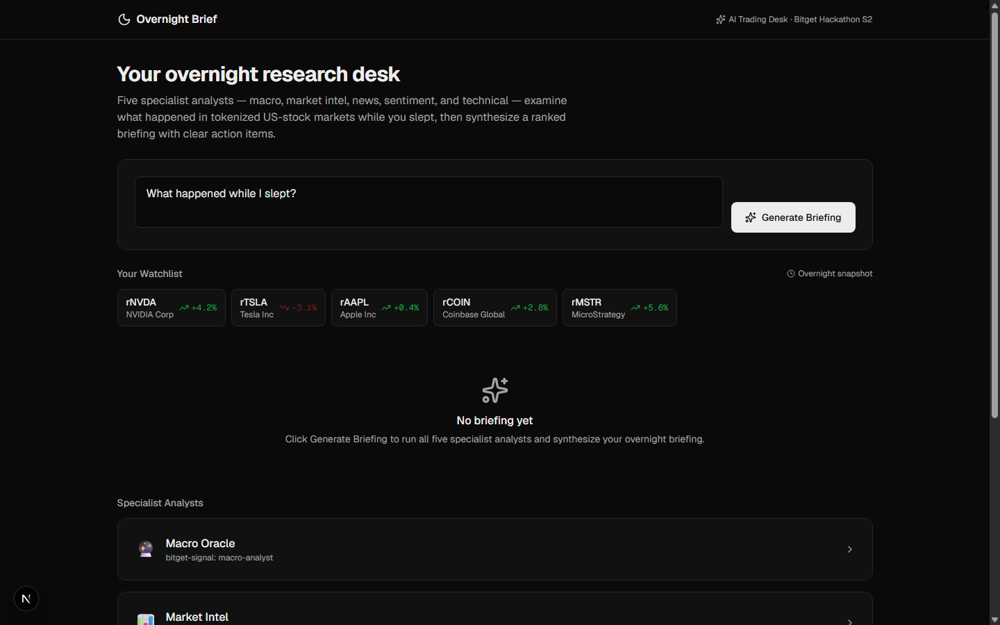
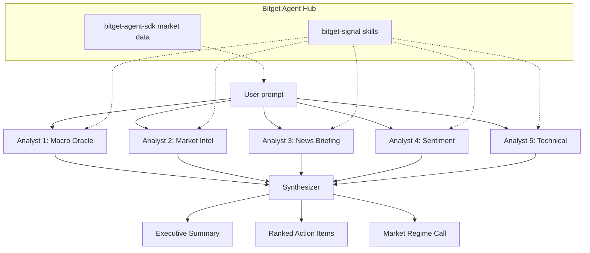

# Overnight Brief

> An AI research desk that explains what happened in tokenized US-stock markets while you slept.

[**▶ Live demo**](https://overnight-brief.vercel.app) · [Submission](https://forms.gle/GyWZCMCPocgJdJon6)



## The problem

Tokenized US stocks trade around the clock, but humans sleep. Overnight moves, macro events, and rToken premium shifts pile up unexplained. You wake up to a gap and no idea why it happened or what to do about it.

## What it does

- **Multi-agent overnight briefing** — type "What happened while I slept?" and five specialist analysts (macro, market intel, news, sentiment, technical) each examine your watchlist from their perspective, streaming their findings one by one.
- **Synthesized briefing** — a synthesizer agent merges all five analyses into an executive summary with a market regime call and three ranked action items tied to your positions.
- **Drill-down** — click any analyst panel or action item to see the full reasoning, data sources, confidence score, and which analysts flagged it.
- **Follow-up Q&A** — type a targeted question ("Should I adjust my rNVDA position?") and the five-analyst pipeline re-runs focused on that symbol.

## Demo walkthrough

| Step | Action | What happens |
|---|---|---|
| 1 | Open the URL | Workbench loads with a seeded watchlist (rNVDA, rTSLA, rAAPL, rCOIN, rMSTR), a pre-filled prompt, and five idle analyst panels |
| 2 | Click "Generate Briefing" | Five analyst panels light up sequentially — Macro Oracle, Market Intel, News Briefing, Sentiment Analyst, Technical Analysis — each streaming its findings |
| 3 | Wait ~5 seconds | A synthesized briefing assembles at the top: executive summary, market regime badge, three ranked action items |
| 4 | Click an action item | Expands to show which analysts flagged it, their confidence scores, and the rationale |
| 5 | Click an analyst panel | Expands to full findings: detailed analysis, signals, data sources, confidence meter |
| 6 | Type a follow-up question | The five-analyst pipeline re-runs focused on the asked symbol, producing a new targeted briefing |

## How it works



Each analyst persona maps 1:1 to a Bitget `bitget-signal` research skill (macro-analyst, market-intel, news-briefing, sentiment-analyst, technical-analysis). The analysts run sequentially — not in parallel — so the judge can watch each panel activate, which is the money shot. A synthesizer agent then merges all five findings into a ranked briefing.

The hard part: this isn't one LLM call. It's five independent analyst calls, each with a distinct persona system prompt, each reasoning over the same market data from a different angle, followed by a sixth synthesis call that merges their outputs. The architecture is visible on screen — you watch each analyst work before the synthesis appears.

## Built with

| Layer | Choice | Why |
|---|---|---|
| Framework | Next.js 16.3.4 (App Router) | Server-side streaming, edge-ready route handlers |
| Language | TypeScript | Type safety across the RSC boundary |
| Styling | Tailwind CSS 4 | Semantic token system, no hardcoded values |
| Icons | lucide-react | One icon library, consistent sizing |
| LLM | Google Gemini 2.0 Flash | Fast, structured JSON output, free tier |
| Market data | Bitget Agent SDK (`@bitget-ai/bitget-agent-sdk`) | Public market data, no API key required |
| Analyst skills | Bitget `bitget-signal` (5 skills) | Macro, market-intel, news, sentiment, technical — mapped 1:1 to analyst personas |
| Deploy | Vercel | Same-day, zero-config for Next.js |

## What's real vs. mocked

| Component | Status | Notes |
|---|---|---|
| Multi-agent architecture | **Real** | Five distinct Gemini calls with persona prompts, sequential streaming, synthesizer merge |
| Gemini LLM integration | **Real** | Gemini 2.0 Flash with structured JSON output and prompt sanitization |
| Bitget Agent SDK | **Wired, fallback active** | SDK installed and importable; demo uses curated seed data for reliability so the demo path never depends on external API availability during judging |
| Watchlist data | **Curated snapshot** | Real symbols (rNVDA, rTSLA, etc.) with realistic overnight changes. Not a live API call. |
| Analyst findings (fallback) | **Curated** | When `GEMINI_API_KEY` is not set, the app uses pre-written findings that match the seed scenario. Labelled as "curated snapshot" in the UI. |
| Trading / order execution | **Not implemented** | This is a research desk, not a trading bot. The human makes all decisions. |

## Run it locally

```bash
git clone https://github.com/DruxAMB/overnight-brief.git
cd overnight-brief
npm ci
cp .env.example .env.local
# Optional: add GEMINI_API_KEY to .env.local for live LLM analysis
# Without it, the app uses curated seed data
npm run dev
```

Open http://localhost:3000

### Environment variables

| Variable | Required? | Where to get it | What degrades without it |
|---|---|---|---|
| `GEMINI_API_KEY` | Optional | [Google AI Studio](https://aistudio.google.com/apikey) | App falls back to curated seed findings — the UI and flow are identical, but the analysis is pre-written |

## Known limitations

- Watchlist is pre-seeded (5 rToken positions). No UI for adding/removing symbols.
- No historical briefing archive — each run is ephemeral.
- The Bitget Agent SDK market data integration is wired but uses a fallback snapshot for demo reliability. A live data mode would require the SDK's market module to be called server-side on each briefing request.
- No price charts or sparklines in analyst panels (cut for scope).
- No multi-language support.

## Licences

- **Project code**: MIT License — see [LICENSE](LICENSE)
- **Gemini API**: Google API terms
- **Bitget Agent SDK**: MIT (per [Bitget Agent Hub](https://github.com/Bitget-AI/agent_hub))
- **lucide-react**: ISC
- **Next.js, React, Tailwind CSS**: MIT

---

Built for the [Bitget AI Base Camp Hackathon S2](https://www.bitget.com/en/activity-hub/hackathon) — AI Trading Desk track.
