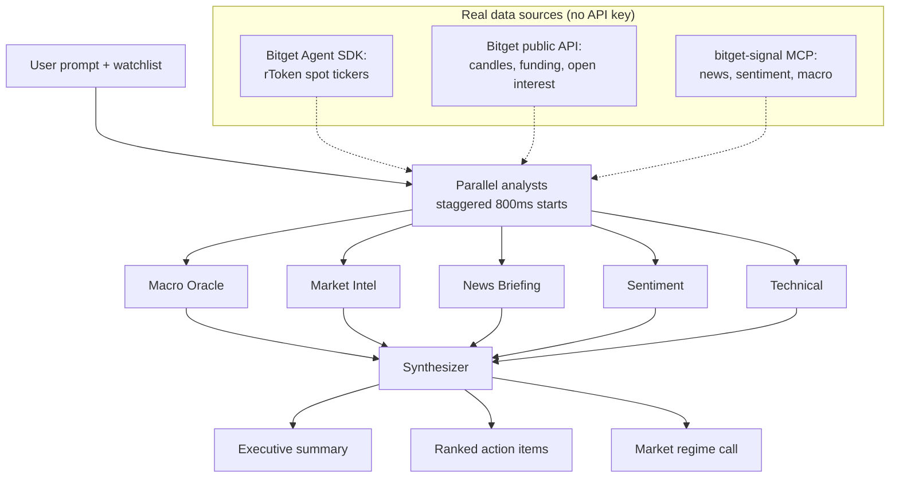

# Overnight Brief

> An AI research desk that explains what happened in tokenized US-stock markets while you slept.

[**▶ Live demo**](https://overnight-brief.druxamb.dev) · [Submission](https://forms.gle/GyWZCMCPocgJdJon6)


## The problem

Tokenized US stocks trade around the clock, but humans sleep. Overnight moves, macro events, and rToken premium shifts pile up unexplained. You wake up to a gap in your position and no idea what caused it or what to do about it.

## What it does

- **Multi-agent overnight briefing.** Ask "What happened while I slept?" and five specialist analysts (macro, market intel, news, sentiment, technical) each examine your watchlist from their own angle. Panels activate one by one, and each shows its real pipeline stages as it works: which data feeds it is pulling, when live data lands, when the LLM is reasoning.
- **Synthesized briefing.** A sixth agent merges the five findings into an executive summary, a market regime call, and three ranked action items tied to your positions.
- **Drill-down.** Click any analyst panel or action item for the full reasoning, signals, confidence score, and cited data sources. The technical panel also shows the raw 24h price action it reasoned over.
- **Follow-up Q&A.** Ask a targeted question ("Should I adjust my rNVDA position?") and the same pipeline re-runs focused on that symbol.
- **Editable watchlist and session archive.** Add or remove rToken symbols; every completed run is saved locally and can be restored into the workbench.
- **Live market tape and desk ledger.** A scrolling ticker of watchlist rTokens plus BTC/ETH runs at the top of the page, and a timestamped activity ledger records every real pipeline event: data fetches, analyst stages, filed findings, synthesis. The finished briefing reports its own depth: analyst count, data sources, signals, actions, and run duration.

## Demo walkthrough

| Step | Action | What happens |
|---|---|---|
| 1 | Open the URL | Workbench with a live watchlist (5 rTokens with real prices and 24h sparklines), a pre-filled prompt, five idle analyst panels |
| 2 | Click "Generate Briefing" | Panels activate one by one on a staggered start; each streams its live pipeline stages ("Pulling funding rates...", "Reasoning with Qwen 3.6 Plus...") |
| 3 | Wait ~2 minutes | Findings land per panel as each analyst finishes, then the synthesized briefing assembles: executive summary, market regime badge, three ranked action items |
| 4 | Click an action item | Expands to show which analysts flagged it, their confidence scores, and the rationale |
| 5 | Click Technical Analysis | Full findings, signal badges, data sources, and the overnight price strip it analyzed |
| 6 | Ask a follow-up | The pipeline re-runs focused on the asked symbol; the previous run moves into the archive |

Generation takes about two minutes end to end because the analysis is real: six LLM calls through the hackathon proxy plus live data fetches. The stage log shows the work while it happens.

## How it works



Each analyst is a Qwen 3.6 Plus call with a distinct persona system prompt, reasoning over a different slice of live data: the macro analyst gets BTC/ETH and DXY/VIX context, market intel gets funding rates and open interest, technical gets hourly candles, and so on. The analysts run in parallel with a staggered start, so panels still light up one by one but the calls overlap; that cut end-to-end time from ~7 minutes to ~2.5.

The hard part: this is not one LLM call with a fancy prompt. Five independent calls each produce a structured finding (summary, details, signals, confidence, cited sources), then a sixth call merges them into a coherent, ranked briefing. Every stage is visible on screen through a live pipeline log, so the judge watches the deliberation instead of a spinner.

## Built with

| Layer | Choice | Why |
|---|---|---|
| Framework | Next.js 16.3.4 (App Router) | Server-side streaming of pipeline events via a route handler |
| Language | TypeScript | Type safety across the RSC boundary |
| Styling | Tailwind CSS 4 | Semantic token system, no hardcoded values |
| Icons | lucide-react + simple-icons | UI icons and stock brand marks |
| LLM | Qwen 3.6 Plus (via Bitget hackathon proxy) | Sponsor LLM, structured JSON output, OpenAI-compatible API |
| Market data | Bitget Agent SDK (`@bitget-ai/bitget-agent-sdk`) + Bitget public REST | Live rToken tickers, candles, funding rates, open interest; no API key required |
| Research signals | bitget-signal MCP server | News, sentiment, macro context; keyless |
| Effects | thinking-orbs, border-beam | Per-analyst animated states, briefing highlight |
| Deploy | Vercel | Same-day, zero-config for Next.js |

## What's real vs. mocked

| Component | Status | Notes |
|---|---|---|
| Multi-agent architecture | **Real** | Five distinct Qwen calls with persona prompts, staggered-parallel streaming, synthesizer merge |
| Qwen LLM integration | **Real** | Qwen 3.6 Plus via the Bitget hackathon proxy (`hackathon.bitgetops.com/v1`), structured JSON output, prompt sanitization, retry on transient errors |
| Bitget market data | **Real** | Live rToken tickers, hourly candles, funding rates, and open interest from Bitget's public endpoints on every briefing request |
| bitget-signal MCP | **Real** | Keyless MCP calls for news, sentiment, and macro context; degrades gracefully when a feed has no data |
| Pipeline stage log | **Real** | The "thinking" text in each panel is emitted by the actual pipeline stages, not scripted |
| Analyst findings | **Real (LLM)** | Three-tier fallback: Qwen analysis, then local reasoning over the fetched real data, then curated seed findings |
| Sparklines | **Real** | Last 24 hourly closes per symbol, fetched live and rendered as inline SVG |
| Watchlist editing + archive | **Real** | localStorage-scoped; no accounts, so it does not sync across devices |
| Trading / order execution | **Not implemented** | Research desk by design. The human makes all decisions |

## Run it locally

```bash
git clone https://github.com/DruxAMB/overnight-brief.git
cd overnight-brief
npm ci
cp .env.example .env.local
# Optional: add BITGET_QWEN_API_KEY to .env.local for live LLM analysis
# Without it, analysts reason over the live fetched data locally
npm run dev
```

Open http://localhost:3000

### Environment variables

| Variable | Required? | Where to get it | What degrades without it |
|---|---|---|---|
| `BITGET_QWEN_API_KEY` | Optional | [Bitget hackathon Qwen proxy](https://bitget-ai.gitbook.io/bitgetai_hackathons2) | Analysts fall back to local reasoning over the real fetched data; the UI and flow are identical |
| `DASHSCOPE_API_KEY` | Optional | Alibaba Cloud DashScope | Accepted as an alternative Qwen credential |

## Known limitations

- Generation takes about two minutes end to end (six real LLM calls through the hackathon proxy plus live data fetches). The stage log covers the wait; shorter prompts or a faster model would cut it further.
- Watchlist edits and the briefing archive are localStorage-scoped: no accounts, no sync across devices. Deliberate, since the demo must be usable without signup.
- When a bitget-signal feed has no data for a domain, that analyst's fallback findings draw on curated seed content rather than live sources.
- No order execution: this is a research desk, not a trading bot.
- No multi-language support.

## Licences

- **Project code**: MIT License, see [LICENSE](LICENSE)
- **Qwen API**: Alibaba Cloud / Bitget hackathon proxy terms
- **Bitget Agent SDK**: MIT (per [Bitget Agent Hub](https://github.com/Bitget-AI/agent_hub))
- **lucide-react**: ISC
- **simple-icons**: CC0-1.0 (brand icons)
- **thinking-orbs, border-beam**: MIT
- **Next.js, React, Tailwind CSS**: MIT

---

Built for the [Bitget AI Base Camp Hackathon S2](https://www.bitget.com/en/activity-hub/hackathon), AI Trading Desk track.
