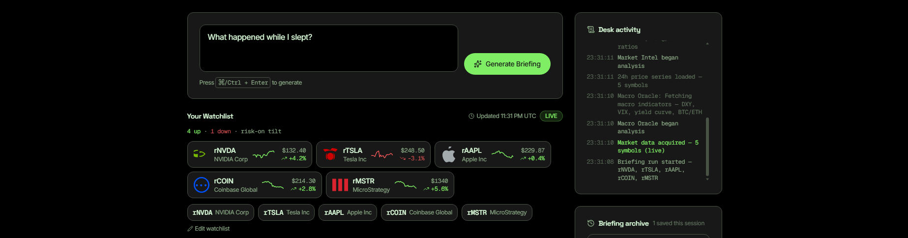
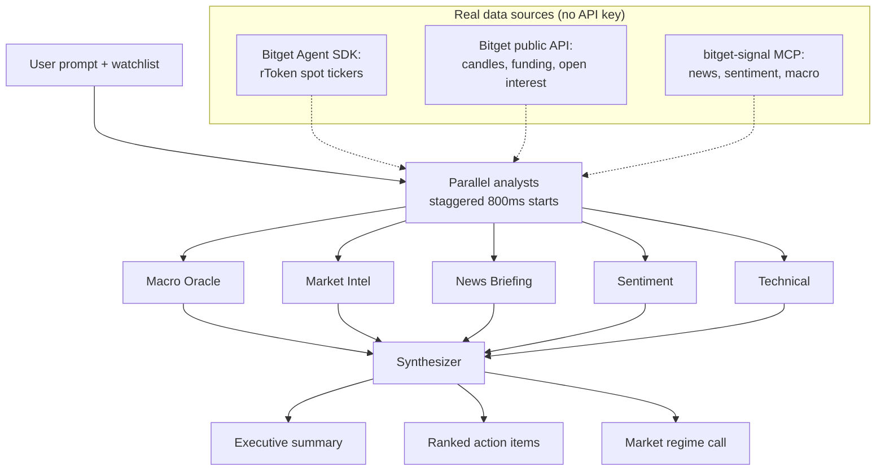

# Overnight Brief

> Wake up to a ranked briefing on what happened in tokenized US-stock markets while you slept. Five specialist AI analysts, one synthesis, three action items.

[**▶ Live demo**](https://overnight-brief.druxamb.dev) · [**Demo video**](https://youtu.be/mAIxLUazUIc)



## The problem

Tokenized US stocks trade around the clock; humans sleep. Overnight moves, macro events, and premium shifts pile up unexplained. You wake to a gap in your position and no idea what caused it.

## What it does

- **Ask once, get a desk briefing.** "What happened while I slept?" fans out to five specialists (macro, market intel, news, sentiment, technical), each reasoning over its own slice of live data. A sixth agent merges the findings into an executive summary, a regime call, and three ranked action items.
- **Watch it work.** Panels activate on staggered starts while streaming their real pipeline stage ("Pulling funding rates", "Reasoning with Qwen 3.6 Plus"). A timestamped ledger records every event, and the finished briefing reports its own depth: analyst count, data sources, signals, actions, duration.
- **Live context, always.** A scrolling tape of watchlist rTokens plus BTC/ETH, a breadth strip ("4 up · 1 down · risk-on tilt"), and 24h sparklines on every chip.
- **Drill down and follow up.** Expand any analyst or action item for full reasoning, signals, confidence, and cited sources. Ask follow-ups ("Should I adjust my rNVDA position?"), edit the watchlist, restore past runs from the local archive.

## How it works



Each analyst is a separate Qwen 3.6 Plus call with a persona system prompt over a different data slice: macro gets BTC/ETH and DXY/VIX context, market intel gets funding rates and open interest, technical gets hourly candles. The calls run in parallel with staggered starts, so panels still light up one by one; end-to-end dropped from ~7 minutes to ~2.2.

The hard part: this is not one LLM call with a fancy prompt. Five independent calls each produce a structured finding (summary, signals, confidence, cited sources), then a sixth call ranks and merges them. Fallbacks are layered: Qwen analysis, local reasoning over the real fetched data, curated seed content last.

## Built with

| Layer | Choice | Why |
|---|---|---|
| Framework | Next.js 16.3.4 (App Router) | Server-side streaming of pipeline events via a route handler |
| Language | TypeScript | Type safety across the RSC boundary |
| Styling | Tailwind CSS 4 | Semantic token system, no hardcoded values |
| Icons | lucide-react + simple-icons | UI icons and stock brand marks |
| LLM | Qwen 3.6 Plus (via Bitget hackathon proxy) | Sponsor LLM, structured JSON output, OpenAI-compatible API |
| Market data | Bitget Agent SDK + Bitget public REST | Live rToken tickers, candles, funding, open interest; keyless |
| Research signals | bitget-signal MCP server | News, sentiment, macro context; keyless |
| Effects | thinking-orbs, border-beam | Per-analyst animated states, briefing highlight |
| Deploy | Vercel | Zero-config for Next.js |

## What's real vs. mocked

| Component | Status | Notes |
|---|---|---|
| Multi-agent architecture | **Real** | Five distinct Qwen calls with persona prompts, staggered-parallel streaming, synthesizer merge |
| Qwen LLM integration | **Real** | Qwen 3.6 Plus via the Bitget hackathon proxy, structured JSON output, retry on transient errors |
| Bitget market data | **Real** | Live rToken tickers, hourly candles, funding rates, and open interest on every briefing request |
| bitget-signal MCP | **Real** | Keyless MCP calls for news, sentiment, and macro context; degrades gracefully per feed |
| Pipeline stage log | **Real** | The "thinking" text is emitted by actual pipeline stages, not scripted |
| Analyst findings | **Real (LLM)** | Three-tier fallback: Qwen, then local reasoning over the fetched data, then curated seeds |
| Sparklines, tape, breadth | **Real** | Live Bitget prices and 24 hourly closes, rendered as inline SVG |
| Watchlist editing + archive | **Real** | localStorage-scoped; no accounts, no cross-device sync |
| Trading / order execution | **Not implemented** | Research desk by design. The human makes all decisions |

## Run it locally

```bash
git clone https://github.com/DruxAMB/overnight-brief.git
cd overnight-brief
npm ci
cp .env.example .env.local
npm run dev
```

Open http://localhost:3000. The app runs fully keyless; adding `BITGET_QWEN_API_KEY` to `.env.local` switches analyst reasoning from local fallback to live Qwen output.

| Variable | Required? | Where to get it | Without it |
|---|---|---|---|
| `BITGET_QWEN_API_KEY` | Optional | [Bitget hackathon Qwen proxy](https://bitget-ai.gitbook.io/bitgetai_hackathons2) | Analysts reason over the fetched data locally; identical flow |
| `DASHSCOPE_API_KEY` | Optional | Alibaba Cloud DashScope | Accepted as an alternative Qwen credential |

## Known limitations

- A full run takes about two minutes: six real LLM calls plus live data fetches. The stage log and ledger cover the wait.
- Watchlist and archive live in localStorage: no accounts, no sync. Deliberate, since the demo must work without signup.
- When a bitget-signal feed returns nothing, that analyst's fallback uses curated seed content rather than live sources.
- No order execution: research desk, not a trading bot. No multi-language support.

## Licences

- **Project code**: MIT, see [LICENSE](LICENSE)
- **Qwen API**: Alibaba Cloud / Bitget hackathon proxy terms
- **Bitget Agent SDK**: MIT
- **lucide-react**: ISC · **simple-icons**: CC0-1.0 · **thinking-orbs, border-beam**: MIT
- **Next.js, React, Tailwind CSS**: MIT

---

Built for the [Bitget AI Base Camp Hackathon S2](https://www.bitget.com/en/activity-hub/hackathon), AI Trading Desk track.
